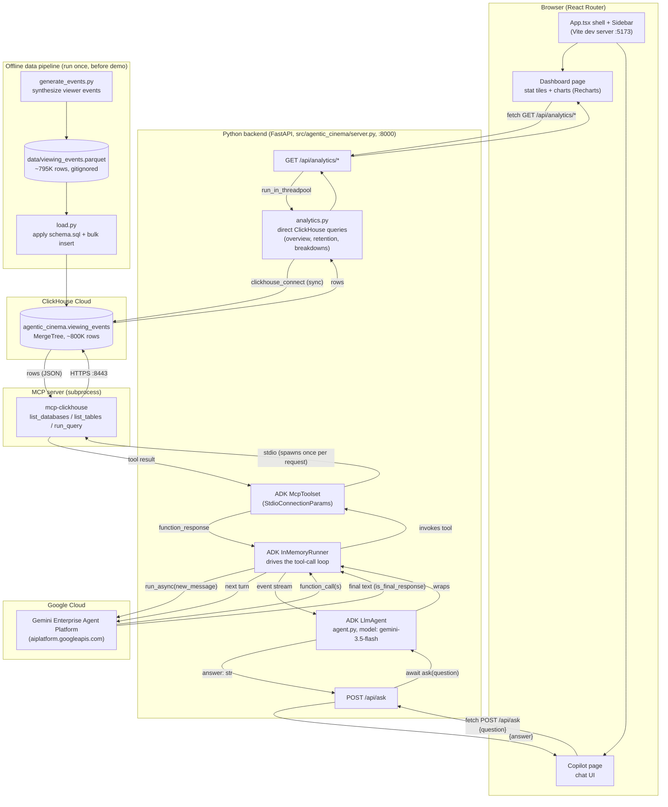

# Architecture

Cutting Room Copilot is an audience-analytics product for a streaming
studio's editorial team, with two surfaces on one backend:

- A **Dashboard** of live viewership metrics and charts, computed directly
  from ClickHouse — fast, no LLM involved.
- A **Copilot** chat for open-ended questions, where an ADK agent queries
  ClickHouse itself, reasons over the results with Gemini, and returns a
  grounded, cited, actionable answer.

## System diagram

## Step-by-step: what happens when the Dashboard loads

1. **Editor opens the Dashboard** (`/`, `frontend/src/pages/Dashboard.tsx`).
   Five independent requests fire in parallel via a small `useAsync` hook,
   one per metric: overview, retention curves, drop-offs by episode, and
   breakdowns by device/region.

2. **Each hits a dedicated FastAPI route** (`server.py`), e.g.
   `GET /api/analytics/retention`, which calls the matching function in
   `analytics.py` through `run_in_threadpool` — ClickHouse's Python client
   is synchronous, so this keeps the blocking query off the event loop that
   also serves longer-running `/api/ask` requests.

3. **`analytics.py` queries ClickHouse Cloud directly** with
   `clickhouse_connect` — no Gemini call anywhere in this path. The
   retention curve is the one non-trivial query: rows are only emitted for
   seek/pause/drop_off/complete events (see the data pipeline below), so
   retention can't be read off row-presence at a timestamp. Instead,
   `get_retention_curves()` fetches each session's actual endpoint
   (`max(position_seconds)` per session) and computes a survival curve —
   % of sessions whose endpoint is at or past each 30s mark — via
   `bisect` over the sorted endpoints.

4. **The frontend renders the response** with Recharts: a multi-series line
   chart for retention (one line per episode, colored from a
   colorblind-validated categorical palette, `charts/RetentionChart.tsx`),
   and single-series bar charts for the rest (`charts/SimpleBarChart.tsx`).
   Entrance animations are disabled (`isAnimationActive={false}`) — Recharts'
   default draw-in animation depends on `requestAnimationFrame`, which
   browsers throttle in backgrounded/unfocused tabs, and a throttled
   animation can visually freeze the chart mid-draw.

## Step-by-step: what happens when an editor asks the Copilot a question

1. **Editor types a question** in the chat UI (`frontend/src/pages/Copilot.tsx`),
   e.g. *"Where do viewers drop off in episode 3, and what should we cut?"*,
   and hits send. The UI immediately appends a user chat bubble and shows a
   spinner ("Querying ClickHouse and analyzing...").

2. **Frontend calls the backend.** `Copilot.tsx` calls `api.ask(question)`
   (`frontend/src/api.ts`), a `fetch` `POST` to `http://localhost:8000/api/ask`
   with `{"question": "..."}` as JSON.

3. **FastAPI receives the request.** `server.py`'s `ask_endpoint` calls
   `agentic_cinema.agent.ask(question)` and awaits the result — this is the
   only thing the API layer does; all the actual reasoning happens inside
   `agent.py`.

4. **The ADK agent is built.** `_build_agent()` constructs an ADK
   `LlmAgent` (`name="cutting_room_copilot"`, `model="gemini-3.5-flash"`)
   with a system instruction that requires every claim to cite a real query
   result, and a single tool: an ADK `McpToolset` pointed at ClickHouse.

5. **The MCP server subprocess spawns.** `McpToolset`'s connection params
   describe *how* to reach ClickHouse: run the `mcp-clickhouse` console
   script (resolved from the venv, see `_clickhouse_command()`) as a child
   process, passing `CLICKHOUSE_HOST` / `PORT` / `USER` / `PASSWORD` as
   environment variables. This subprocess speaks the Model Context Protocol
   over stdio and exposes three tools: `list_databases`, `list_tables`,
   `run_query`.

6. **A session and runner are created.** `InMemoryRunner` wraps the agent
   with in-memory session/artifact/memory services (no external state store
   needed for a single request-response turn), and a fresh session is
   created for this question.

7. **The agent loop runs** (`runner.run_async`), entirely inside ADK — this
   replaces what used to be a hand-written function-calling loop:
   - Gemini receives the question + system instruction + the three MCP tool
     schemas (name, description, JSON parameter schema, auto-derived from
     the MCP server's own tool definitions).
   - Gemini decides it needs data and returns a `function_call`, e.g.
     `run_query({"query": "SELECT episode_id, count() FROM ... WHERE
     event_type='drop_off' GROUP BY episode_id"})`.
   - ADK's runner executes that call against the live `mcp-clickhouse`
     subprocess, which opens an HTTPS connection to ClickHouse Cloud,
     runs the SQL, and returns rows as JSON.
   - The result is fed back to Gemini as a `function_response`, and the
     loop repeats — typically the agent starts broad (aggregate drop-offs
     per episode), then narrows into the specific episode and a timestamp
     window, cross-checks by device/region to rule out a technical bug,
     sometimes checks how the episode's ending correlates with the next
     episode's viewership — then stops once it has enough to answer.
   - Each turn is streamed out of `run_async` as an `Event`; `agent.py`
     watches for `event.is_final_response()` and, once found, joins that
     event's text parts into the final answer string.

8. **Every query hits real data.** Nothing in this loop is mocked: the
   ~800K-row `viewing_events` table in ClickHouse Cloud is queried live for
   every tool call, and Gemini Enterprise Agent Platform
   (`aiplatform.googleapis.com`, enterprise-mode `google-genai` client) is
   called live for every reasoning turn.

9. **The answer flows back.** `agent.ask()` returns the final markdown
   string → `server.py` wraps it as `{"answer": "..."}` → the frontend
   renders it with `react-markdown` (tables, bold, code all supported) in
   an assistant chat bubble, and the spinner disappears.

10. **Cleanup.** `runner.close()` runs in a `finally` block, releasing the
    MCP subprocess and in-memory session state — each question is a fully
    independent, stateless request from the API's point of view.

## Offline data pipeline (run once, before demoing)

This part doesn't run per-request — it seeds ClickHouse with the dataset the
agent queries.

1. **`generate_events.py`** synthesizes a viewer-event stream for a fictional
   6-episode series (`nebula-heist`). For each of 50,000 synthetic users, it
   simulates a session per episode watched: `play` → periodic `seek`/`pause`
   events every 30 simulated seconds → either a random `drop_off` or a
   `complete`. One deliberate signal is injected — episode 3 has a "slow
   patch" (seconds 1180–1420) with a much higher drop-off probability — so
   the agent has a real, discoverable pattern to find, everything else being
   noise. Output: `data/viewing_events.parquet` (~795K rows, gitignored).

2. **`schema.sql`** defines `agentic_cinema.viewing_events` as a ClickHouse
   `MergeTree` table, partitioned by month and ordered by
   `(content_id, episode_id, event_ts)`.

3. **`load.py`** connects to ClickHouse Cloud (`clickhouse-connect`), applies
   the schema, and bulk-inserts the parquet data in 200K-row chunks.

## Component reference

| Component | File | Responsibility |
|---|---|---|
| App shell | `frontend/src/App.tsx` | Sidebar + React Router routes (`/` Dashboard, `/copilot` Copilot) |
| Dashboard page | `frontend/src/pages/Dashboard.tsx` | Fetches all analytics endpoints, lays out stat tiles + chart cards |
| Copilot page | `frontend/src/pages/Copilot.tsx` | Chat input, message history, markdown rendering, loading/error states |
| Charts | `frontend/src/charts/RetentionChart.tsx`, `SimpleBarChart.tsx` | Recharts wrappers styled to the validated categorical palette |
| API client | `frontend/src/api.ts` | Typed `fetch` helpers for every backend endpoint |
| API | `src/agentic_cinema/server.py` | FastAPI: `POST /api/ask` → `agent.ask()`; `GET /api/analytics/*` → `analytics.py` |
| Agent | `src/agentic_cinema/agent.py` | ADK `LlmAgent` + `McpToolset` + `InMemoryRunner`; system instruction; response extraction |
| Analytics | `src/agentic_cinema/analytics.py` | Direct (non-LLM) ClickHouse queries backing the dashboard |
| MCP server | `mcp-clickhouse` (installed dependency) | Exposes ClickHouse as MCP tools (`list_databases`, `list_tables`, `run_query`) |
| Data generator | `src/agentic_cinema/data/generate_events.py` | Synthesizes the viewer-event dataset |
| Schema/loader | `src/agentic_cinema/data/schema.sql`, `load.py` | Defines and populates the ClickHouse table |
| Connectivity checks | `scripts/check_clickhouse_connection.py`, `scripts/check_mcp_clickhouse.py` | Standalone smoke tests for the ClickHouse and MCP layers, independent of Gemini |

## Why ADK instead of a hand-rolled tool loop

An earlier version of `agent.py` called the raw `google-genai` SDK directly
and drove the function-calling loop by hand. Two real problems came up along
the way, both now avoided by using ADK:

- Passing a live `mcp.ClientSession` straight into `tools=[...]` (the
  pattern shown in the SDK's own docs) crashed, because the SDK deep-copies
  `GenerateContentConfig` on every call, and a live session holds
  non-picklable `asyncio.Future` objects.
- `response.text` (the SDK's convenience property) silently returns `None`
  whenever a candidate mixes text with a non-text part — which surfaced as
  the literal string `"None"` rendering in the UI.

ADK's `McpToolset` + `InMemoryRunner` handle the MCP connection and the
tool-call loop natively, sidestepping both issues, and also match the
hackathon's explicit guidance to build agents on the Agent Development Kit
rather than a hand-rolled wrapper.
